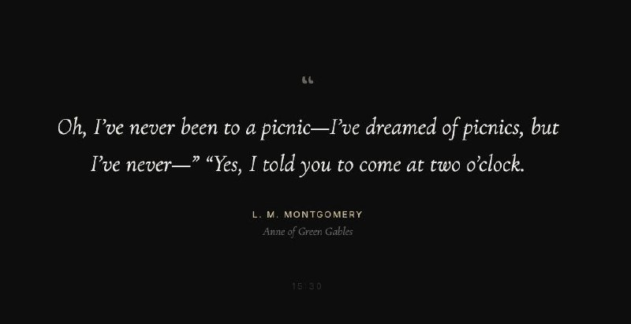
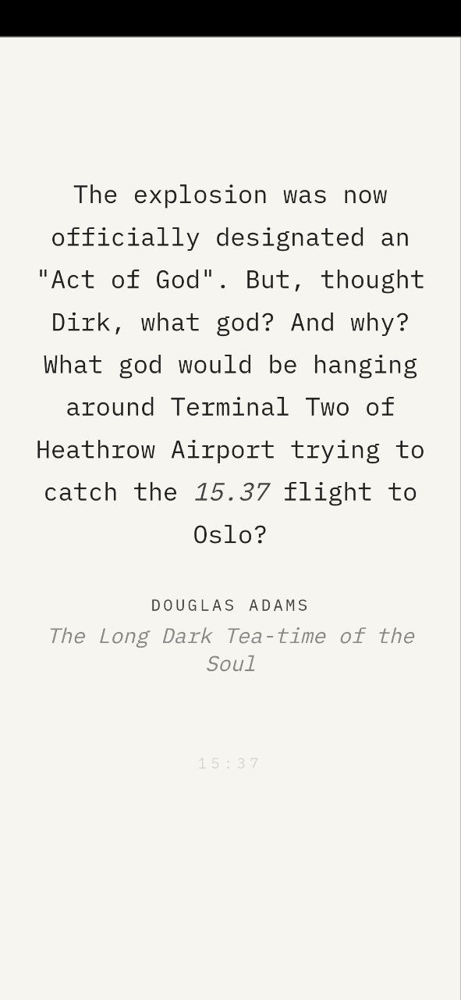

# Literature Clock

**Time, told through fiction.**

A minimal web clock that displays a literary quote matching the current time. Every minute, a new passage — drawn from novels, poetry, and stories — where the exact time appears in the text.

**[→ Try it live](https://simiono.com/clock/)** · **[Read the essay](https://simiono.com/Literature-Clock.html)**

| Web | Android PWA |
|:---:|:---:|
|  |  |

## The Clock

A single screen. The time. A quote. The book. The author. Nothing else.

The clock cycles through curated literary excerpts where the current time is explicitly mentioned. At 07:30, you might read Hemingway. At 23:15, perhaps Murakami. Every minute of the day has its own literary moment.

- **Typography-first.** The quote is the hero. Large, elegant serif font.
- **Dark mode default.** Warm off-white text on deep black. Easy on the eyes at 3 AM.
- **No UI chrome.** No buttons, no menus. Click/tap for next quote at same time.
- **Responsive.** From phone nightstand to wall-mounted display.

## Collection

**996 quotes** from **252 authors** across **311 unique time slots**.

Quotes stored as JSON in `data/quotes.json`:

```json
{
  "time": "17:05",
  "quote": "It was five minutes past five in the afternoon when the train pulled in.",
  "author": "Graham Greene",
  "title": "The Orient Express",
  "language": "en"
}
```

## Quote Extraction Tool

The repo includes `scripts/extract-quotes.py` — a Python tool that scans ePub files for time-of-day references and outputs them as import-ready CSV or JSON.

```bash
# Single book
python3 scripts/extract-quotes.py book.epub

# Entire library
python3 scripts/extract-quotes.py /path/to/library/ -o found-quotes.csv

# Only high-confidence matches, as JSON
python3 scripts/extract-quotes.py *.epub --confidence high --json
```

**Pattern recognition** covers digital times (3:45 PM), military (0800h), word forms ("half past seven", "quarter to nine", "the clock struck twelve"), with AM/PM inference from context ("morning", "dinner", "dusk"). Each match gets a confidence level (high/medium/low).

**Dependencies:** `pip install ebooklib beautifulsoup4 lxml`

## Roadmap

- [x] Static site with time-based quote display
- [x] Typography selection (Cormorant Garamond)
- [x] Deploy to simiono.com
- [x] ePub quote extraction tool with confidence scoring
- [x] PWA manifest + service worker for offline
- [x] Batch ePub processing pipeline with review queue
- [ ] Parse more books — grow the collection
- [ ] Fill time gaps (minutes without any quote)
- [ ] Smooth fade transitions between minutes
- [ ] Screensaver builds (macOS, Windows)
- [ ] German quotes as secondary collection

## License

AGPL-3.0 — see [LICENSE](LICENSE).

## Author

[simiono](https://simiono.com) · Uwe Trostheide
